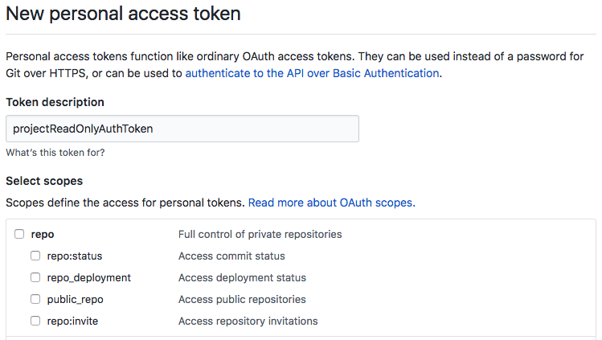
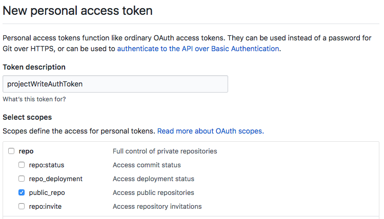

## Getting started

Thank you for using Shipkit!
See also [documentation index](/README.md#documentation)

Please help us with the documentation.
Pull requests are very welcome!

To quickly learn how Shipkit works you can test drive this guide using our [Shipkit Bootstrap project](https://github.com/mockito/shipkit-bootstrap).
Otherwise, apply below steps to your own project:

### Adding dependency

Add below to your root "build.gradle" file.
Get the latest version of "org.shipkit.java" plugin from [Gradle Plugin Portal](https://plugins.gradle.org/plugin/org.shipkit.java)

```Gradle
plugins {
    id "org.shipkit.java" version "TODO"
}
```

or, if you're not releasing a typical java project:

```Gradle
plugins {
    id "org.shipkit.base" version "TODO"
}
```

<details>
    <summary>For advanced users, if you need to use the traditional way of configuring Gradle plugins</summary>

```Gradle
buildscript {
    repositories {
        maven { url "https://plugins.gradle.org/m2/" }
    }

    dependencies {
        classpath "org.shipkit:shipkit:TODO"
    }
}

apply plugin: "org.shipkit.java"
```

If you don't work with traditional Gradle Java project apply:

```Gradle
apply plugin: "org.shipkit.base"
```

</details>

### Initializing Shipkit

When you are done you can open the terminal and in your project’s root directory run the following command:

    ./gradlew initShipkit

This will generate all configuration files that you need.

* version.properties — it has the information about version of your project.
From now on you should have version specified only here, instead of in any of the Gradle configuration files.
The default value is based on your current version of the project, taken from Gradle project.version or “0.0.1” if unspecified.
You can override it yourself by changing ‘version’ property manually.

* shipkit.gradle — it’s a place for all configuration properties (GitHub repo, Bintray etc).
It is filled with examplary values and a few may be kept but most of them you need to change by yourself.

* .travis.yml — this file is needed by Travis and it specifies what kind of build logic will be executed there.

### Shipkit.gradle configuration file

"gradle/shipkit.gradle" file:

```Gradle
shipkit {
    gitHub.repository = "wwilk/shipkit-demo"
    gitHub.readOnlyAuthToken = "e7fe8fcfd6ffedac384c8c4c71b2a48e646"
}
```

Property **github.repository** is by default filled with your remote origin URL, while **github.readOnlyAuthToken** uses generic [shipkit-org](https://github.com/shipkit-org) account.
It is sufficient to try out a release locally.
More info about how to generate GitHub's tokens is in [Production configuration](#production-configuration)

### Bintray configuration

"gradle/shipkit.gradle" file:

```Gradle
allprojects {
    plugins.withId("org.shipkit.bintray") {
        bintray {
            key = '7ea297848ca948adb7d3ee92a83292112d7ae989'
            pkg {
                repo = 'bootstrap'
                user = 'shipkit-bootstrap-bot'
                userOrg = 'shipkit-bootstrap'
                name = 'maven'
                licenses = ['MIT']
                labels = ['continuous delivery', 'release automation', 'shipkit']
            }
        }
    }
}
```

To try out Shipkit you don’t need to change any Bintray configuration!
Generated shipkit file is configured to publish to sandbox [shipkit-bootstrap](https://bintray.com/shipkit-bootstrap/bootstrap/maven/) Bintray organisation.

### Commit local changes

Before testing the release, it's best to commit your local changes:

 - files generated by 'initShipkit' task
 - your modifications to 'build.gradle' file

### Test run

    ./gradlew performRelease

It will use your local GitHub authentication, Shipkit Bootstrap Bintray repository to:

- increment the project's version
- update release notes
- create a new version tag
- commit and push changes
- upload artifacts to Shipkit Bootstrap

### Production configuration

When you are done testing Shipkit and you want to use it on production there is only a couple of things you need to do.

#### GitHub

You need to generate personal access tokens on GitHub.

#####  Read only token

  Read-only token will be checked in with the source code and will enable any contributor to perform light release testing (preview release notes, automatically generate contributors for poms, etc).
  1. Go to [Personal access tokens](https://github.com/settings/tokens) page
  2. Click **Generate new token**
  3. Give your token a descriptive name (read only token)
  4. Please don't check any scope


  5. Click **Generate token**
  6. Copy Token and paste it as value of `readOnlyAuthToken` in "shipkit.gradle"

##### Write token

  Write token should be used on CI machine to perform actual releases.
  1. Go to [Personal access tokens](https://github.com/settings/tokens) page
  2. Click **Generate new token**
  3. Give your token a descriptive name (write token)
  4. Please check `public_repo`


  5. Click **Generate token**
  6. Copy Token
  7. Export write token as **GH_WRITE_TOKEN** env variable on Travis CI.
  We recommend configuring env variables in [Travis CI repository settings](https://docs.travis-ci.com/user/environment-variables/#Defining-Variables-in-Repository-Settings).

#### Shipkit

There is a lot of other properties that you can change in shipkit extension.
You can find them [here](https://github.com/mockito/shipkit/blob/master/subprojects/shipkit/src/main/groovy/org/shipkit/gradle/configuration/ShipkitConfiguration.java).

#### Bintray

You need to change default values in shipkit.gradle to the appropriate ones for your project.
For this you have to sign up for Bintray's free open source plan, and at least one repository.
See Bintray's [getting started guide](https://bintray.com/docs/usermanual/starting/starting_gettingstarted.html).

Once you created Bintray account, please generate [Bintray API key](https://www.jfrog.com/confluence/display/BT/Interacting#Interacting-APIKey) so that you can publish automatically to your repositories.
For safety, don't check in the API key to Git.
Instead, configure **BINTRAY_API_KEY** environment variable in [Travis CI repository settings](https://docs.travis-ci.com/user/environment-variables/#Defining-Variables-in-Repository-Settings).

Finally, configure few other Bintray settings in "shipkit.gradle" file, like repo name, user name, etc.
Shipkit uses Gradle Bintray Plugin underneath and its Bintray extension, so you [can check the documentation](https://github.com/bintray/gradle-bintray-plugin) to get more details and other properties you can configure.

#### Travis configuration

You can sign in to Travis with your GitHub account, and then you need to enable your project to be built on Travis.
Here is how generated (by running initShipkit task) ".travis.yml" file looks like:

```yml
# More details on how to configure the Travis build
# https://docs.travis-ci.com/user/customizing-the-build/

language: java

jdk:
  - oraclejdk8

#don't build tags
branches:
  except:
  - /^v\d/

#Build and perform release (if needed)
script:
 - ./gradlew build -s && ./gradlew ciPerformRelease
```

The "script" part of Travis CI setup consists of 2 operations separate with "&&".
This is the easiest way to configure releases in Travis.
The first operation is typically the "build" command, but you totally configure it.
Second operation uses "&&" so that it is only triggered if the build succeeds.
"ciPerformRelease" task is the core of Shipkit, it aggregates few other tasks:

- **releaseNeeded** which checks if release should be made during this build.
There is a number of ways how you can skip release — eg. by using **[ci skip-release]** in your commit message or set **SKIP_RELEASE** environment variable.
You can find more ways here.
- **ciReleasePrepare** that sets up Git configuration on Travis, eg. sets git.user and git.email properties
- **performRelease** which, among others, bumps PATCH part of the semantic version in your version.properties, updates release notes and publishes artifacts to Bintray

This is it! Shipkit is now configured in your project.
You can try it by pushing anything to master, which should start the Travis build.

### Reference projects

Sometimes it is best to learn from real projects.
You can view "shipkit.gradle", ".travis.yml" and "build.gradle" of projects that already use Shipkit:

 - [Shipkit Example](https://github.com/mockito/shipkit-example) - small and simple example, best to get started
 - [Mockito](https://github.com/mockito/mockito) - real project with various interesting Shipkit customizations
 - [Powermock](https://github.com/powermock/powermock) - another real project
 - [Shipkit Bootstrap project](https://github.com/mockito/shipkit-bootstrap) - use it to learn Shipkit quickly by test driving this user guide.
 Bootstrap project does not use Shipkit until you make it so :)

Thank you for reading!
Questions or feedback?
Start discussion [by opening a ticket](https://github.com/mockito/shipkit/issues/new) in GitHub!

